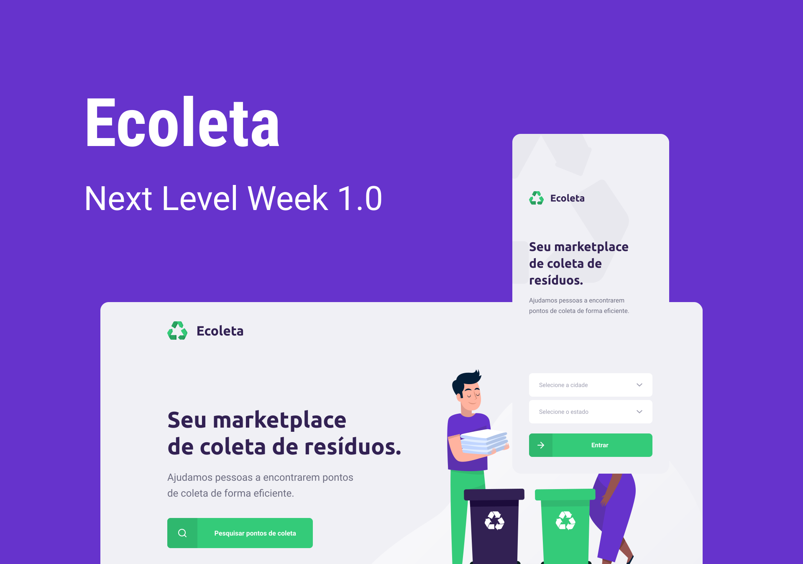

<h1 align="center">NextLevelWeek</h1>

  

  
  
  
  
  
  

> Projeto Ecoleta, realizado durante o evento Next Level Week da Rocketseat

### 🏠 [Homepage](https://github.com/antonycms/next-level-week-01)

## Projeto

O **Ecoleta** é uma aplicacao desenvolvida com o intuito de criar uma conexão entre as empresas/entidades responsaveis pela coleta de residuos e as pessoas.

## Requisitos

- npm >=6.14.4
- node >=12.17.0

## Diretorios do projeto
 -  `backend` (aplication server)
 -  `frontend` (web aplication)
 -  `mobile` (mobile aplication)

## Tecnologias e libs utilizadas
* Backend
  - `Nodejs`
  - `Yup`
  - `Knex`
  - `Express`
  - `Cors`
  - `Typescrip`
* Frontend Web 
  - `ReactJS`
  - `React Router DOM`
  - `Axios`
  - `Leaflet`
  - `Typescrip`
* Mobile
  - `React Native`
  - `React Navigation`
  - `React Native Maps`
  - `Expo`
  - `Typescript`

## Lints
- `ESLint`
- `Prettier`
- `Editorconfig`

#

👤 **Antony Santos**

* Github: [@antonycms](https://github.com/antonycms)

## Deixe seu suporte

Deixe uma ⭐️ se esse projeto ajudou você!

## 📝 Licença

Copyright © 2020 [Antony Santos](https://github.com/antonycms). 
Este projeto possui licença [MIT](https://github.com/antonycms/next-level-week-01/blob/master/LICENSE).

***
_Este README foi gerado utilizando [readme-md-generator](https://github.com/kefranabg/readme-md-generator) ❤️_