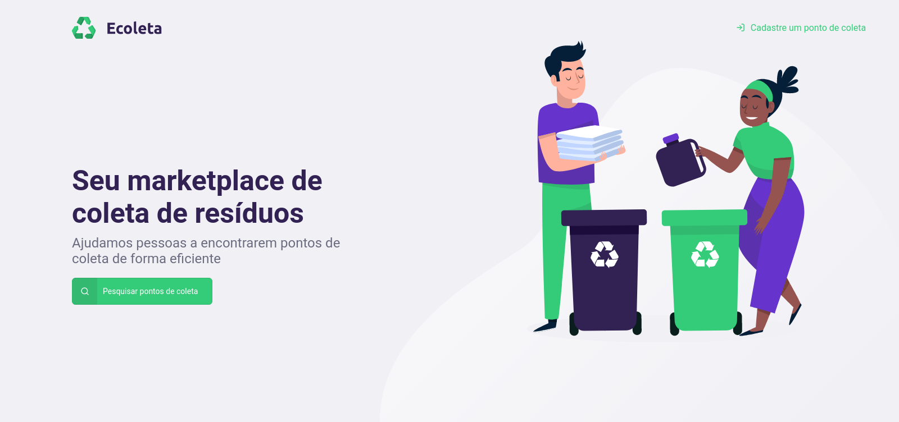

<h1 align="center">Next Level Week - Mobile👋</h1>
<p>
  
  
  
  <a href="https://github.com/kefranabg/readme-md-generator#readme" target="_blank">
    
  </a>
  <a href="https://github.com/kefranabg/readme-md-generator/graphs/commit-activity" target="_blank">
    
  </a>
  <a href="https://github.com/kefranabg/readme-md-generator/blob/master/LICENSE" target="_blank">
    
  </a>
</p>

> Projeto Ecoleta, desenvolvido durante o evento Next Level Week da Rocketseat



### 🏠 [Homepage](https://github.com/antonycms/next-level-week-01)

## Requisitos

- npm >=6.14.4
- node >=12.17.0

## Tecnologias e libs utilizadas
- React Native
- Axios
- Expo
- Expo Location
- Expo Fonts
- React Navigation
- Typescript

## Lints
- Prettier
- Eslint
- Editorconfig

#
## Instalação

```sh
yarn install
```
ou
```sh
npm install
```
#
## Rodando o projeto
* atraves do aparelho
  ```sh
  yarn start
  ```
  ou
  ```sh
  npm start
  ```

* atraves do navegador
  ```sh
  yarn web
  ```
  ou
  ```sh
  npm run web
  ```

#

👤 **Antony Santos**

* GitHub: [@antonycms](https://github.com/antonycms)

#
## Deixe seu suporte

Deixe uma ⭐️ se esse projeto ajudou você!

## 📝 Licença

Copyright © 2020 [Antony Santos](https://github.com/antonycms).<br />
Este projeto possui licença [MIT](https://github.com/antonycms/next-level-week-01/blob/master/LICENSE).

***
_Este README foi gerado utilizando [readme-md-generator](https://github.com/kefranabg/readme-md-generator) ❤️_